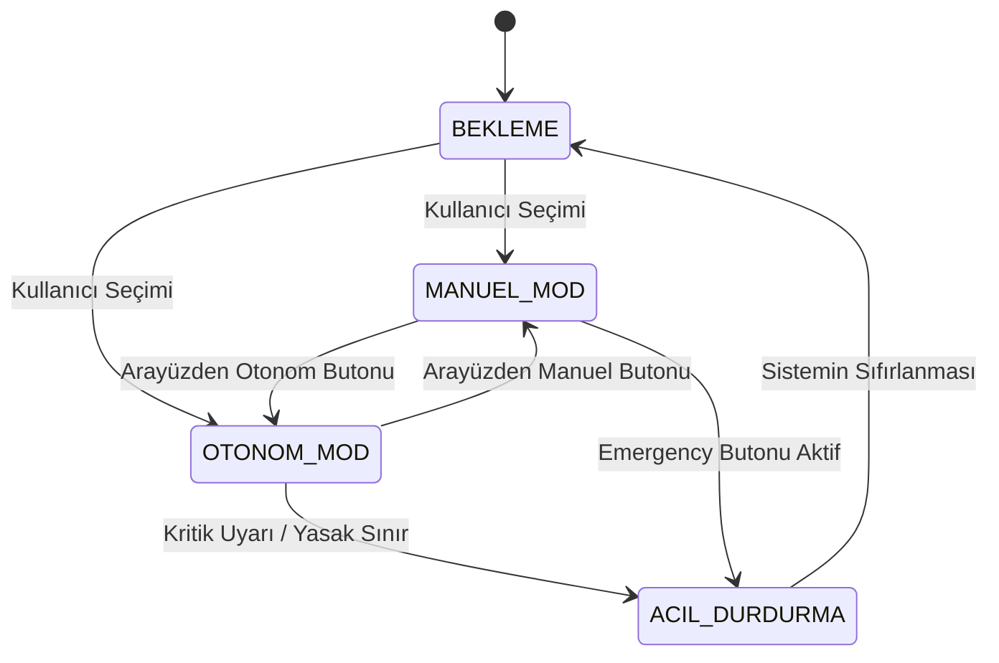
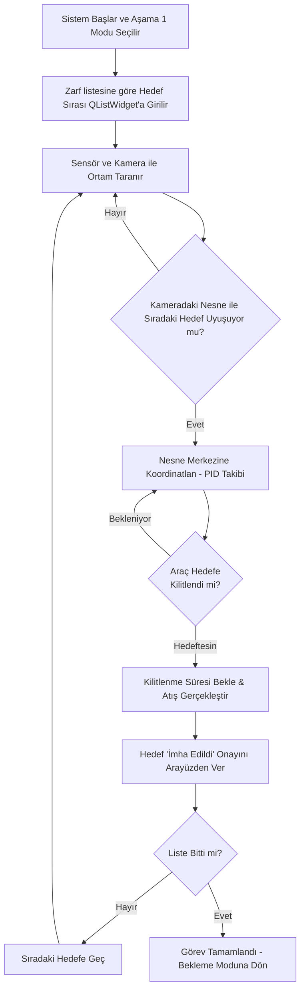
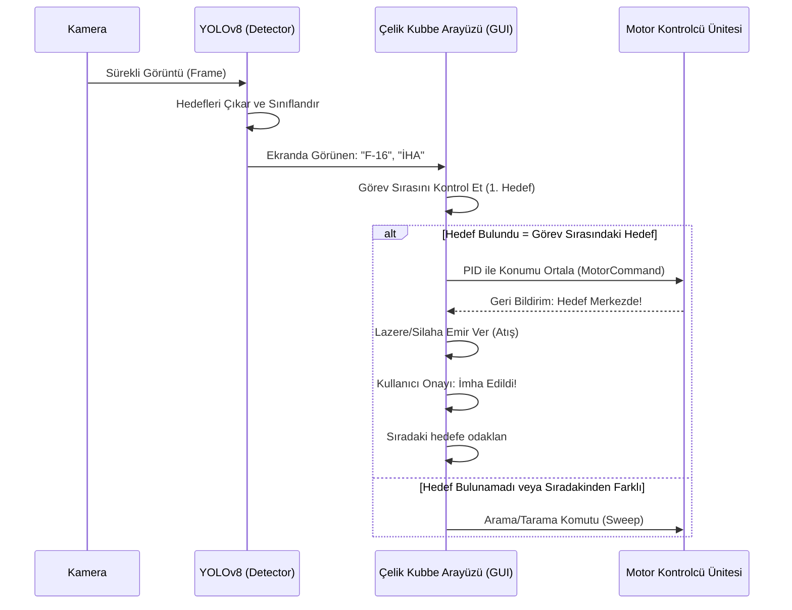
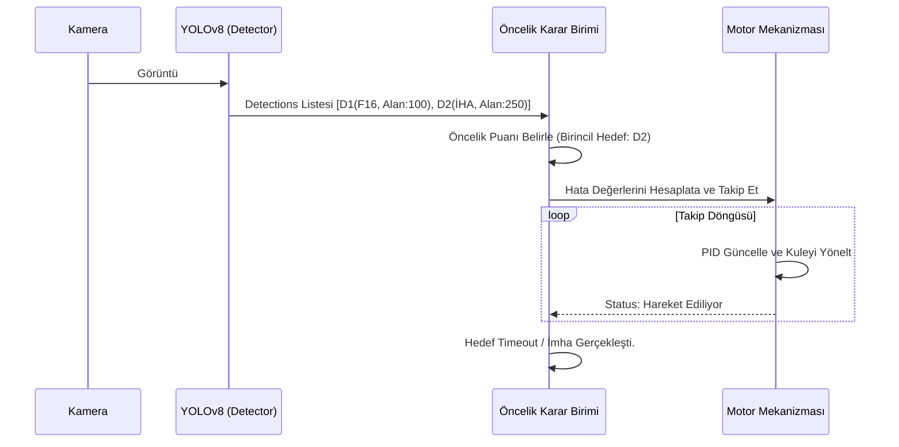
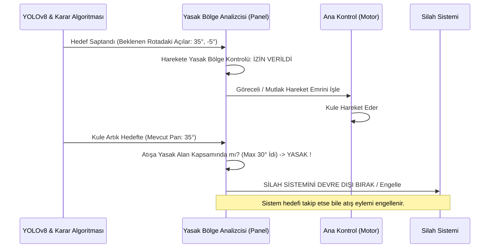

# Hava Savunma Sistemi (HSS) Yazılım ve Tasarım Raporu

## 1. Sistemde Yer Alacak Yazılım Bileşenleri

Sistem kurgusunda yer alan temel yazılım, algoritma ve framework bileşenleri aşağıda tanımlanmıştır. 

### 1.1 Yazılım ve Algoritma Bilgi Tablosu


|BİLEŞENLER|ÜRETİCİ|VERSİYON|ÖZELLİKLERİ|
| :--- | :--- | :--- | :--- |
| **YOLOv8** | Ultralytics | v8.x | Hava hedeflerinin (İHA/Balon) gerçek zamanlı tespiti, sınıflandırılması ve koordinatlarının ROS 2 topic'lerine aktarılması.|
| **OpenCV** | OpenCV | 4.x |Görüntü işleme, bağımsız kamera akışı alma ve sensor_msgs/Image formatında ROS 2 ağına basma.|
| **PyQt6** | Riverbank Computing | 6.x | Kullanıcı arayüzü (GUI) sunma ve ROS 2 ağına abone olarak sistem logları ile anlık kamera görüntülerini eşzamanlı gösterme.|
| **micro-ROS** | eProsima | Son Sürüm | ESP32 mikrodenetleyicisini doğrudan ROS 2 ağına bir düğüm (node) olarak bağlamak ve motor komutlarına donanım seviyesinde abone olmak.|
| **AccelStepper** | Mike McCauley | Son Sürüm | Step motorların ESP32 üzerinden ivmeli (hızlanıp yavaşlayarak) yumuşak ve hassas sürüşünü sağlamak.|
| **Çift Eksenli (DualAxis) PID Algoritması** |Özgün Tasarım |- | Görüntü işleme merkezinden alınan piksel hatasını sıfıra indirmek için motor güç çıkışını (hata payını) hesaplamak. |
| **Motor Açı-Piksel Dönüşüm Algoritması** | Özgün Tasarım | -|Kameranın görüş açısı (FOV) ile pikselleri fiziksel dereceye dönüştürüp, hedefin yönelimini motor adım değerlerine formüle etmek.|
| **ROS 2 (Robot Operating System)** |Open Robotics|Humble|Düğümler (nodes) arası asenkron yayıncı/abone (Pub/Sub) haberleşmesini (DDS) sağlamak; alt sistemleri izole ederek hata toleransını artırmak.|


### 1.2 Yazılımların Birbirleriyle Arayüzleri ve İletişim Şeması

- **Görev Yönetim ve Koordinasyon Arayüzü (Mission Control Node)** Sistemin ana karar mekanizması ve orkestratörü olarak çalışan bu merkezi ROS 2 düğümü, alt sistemlerden gelen verileri doğrudan donanıma aktarmak yerine stratejik görev planlamasını ve durum makinası (State Machine) geçişlerini yönetir. Şartnamede belirtilen "yanlış sıradaki hedefin imha edilmesi durumunda 5 ceza puanı" kuralını bertaraf etmek amacıyla gelişmiş bir Hedef Filtreleme ve Doğrulama (Target Discrimination) algoritması koşturur; Tespit Arayüzünden (YOLO) /detection/target_info başlığıyla alınan tüm potansiyel hedef verilerini, operatörün KKS üzerinden girdiği indeks sırasıyla eşleştirerek sadece doğru hedefin koordinatlarını Kontrol Arayüzüne (PID) iletir ve hatalı kilitlenme riskini sıfıra indirir. Buna ek olarak, hedefin anlık olarak görüş alanından çıkması durumunda "Kestirim (Coasting)" modunu tetiklemek gibi otonom senaryoları yönetirken, KKS üzerinden yayınlanan Acil Durdurma (E-Stop) komutlarına sürekli abone olarak, sistemin içinde bulunduğu durum (otonom veya manuel) fark etmeksizin tüm motor tahrik komutlarını anında kesen ve taret donanımını "Güvenli Mod"a (Safe State) alan kesintisiz bir emniyet (fail-safe / interrupt) altyapısı sunar.

- **Görüntü Yakalama Arayüzü (Camera Node)** Bağımsız çalışan kamera düğümü, donanımdan sürekli olarak aldığı ham görüntü karelerini işleyerek /camera/image_raw başlığı altında ağa yayınlar (Publish).

- **Hedef Tespit ve Teşhis Arayüzü (YOLOv8 Node)** Tespit düğümü görüntü başlığına abone olur (Subscribe). Görüntü üzerindeki hava hedeflerini (İHA, Balon vb.) tespit eder ve hedefin merkez koordinatları ile bounding box (sınır kutusu) verilerini /detection/target_info başlığında paylaşır.

- **Hata Hesaplama PID Kontrolcüsü ve Kinematik Hesaplayıcı (PID & Motor Calc Node)** Bu arayüz, tespit edilen hedefin piksel verilerini alarak ekran merkezine göre konum hatasını (X ve Y ekseninde) hesaplar. DualAxis PID Kontrolcüsü ile işlenen bu hata payı, Motor Dönüşüm Hesaplayıcısı tarafından fiziksel yönelim ve adım (step) değerlerine formüle edilir. Elde edilen kesin hareket komutları /control/motor_setpoint başlığına aktarılır.

- **Seri Haberleşme Arayüzü (micro-ROS & ESP32)** Ana kontrolcü (PC) ile ESP32 (motor sürücü anakart) arasındaki haberleşme için en güncel yöntem olan micro-ROS (UART/Seri üzerinden) tercih edilmiştir. ESP32, ağda doğrudan bir ROS 2 düğümü gibi davranarak motor komutlarına abone olur. Ekstra bir metin ayrıştırma (JSON parsing) işlemine gerek kalmadan alınan bu komutlar, donanım seviyesinde AccelStepper kütüphanesi ile işlenerek taretin pürüzsüz ve ivmeli hareketini sağlar.

- **Komuta Kontrol Arayüzü (GUI Node - PyQt6)** PyQt6 tabanlı komuta kontrol arayüzü, sistemdeki ilgili topic'leri dinleyerek operatöre canlı video akışını, hedef kilitlenme durumunu ve motorların anlık açısal verilerini (telemetri) eşzamanlı olarak sunar.


```mermaid
graph TD
    A[Görüntü Kaynağı - OpenCV/PiCamera] -->|Frame/Görüntü Matrisi| B[YOLOv8 Modeli - Ultralytics]
    B -->|Hedef Sınıfı & Bounding Box| C[Ana Karar ve Takip Döngüsü - main.py]
    C -->|Pixel Hatası (Error X, Y)| D[MotorCalculator & PID Controller]
    D -->|Motor Komutu - Pan Step / Tilt PWM| E[SerialCommunicator - PySerial]
    E -->|JSON String UART Sinyali| F[Motor Controller - Arduino]
    F -->|Step/Dir Sinyalleri| G[A4988 Sürücü & NEMA 17 Pan]
    F -->|PWM/Yön Sinyalleri| H[L298N Sürücü & JGY-370 Tilt]
    C <-->|Kamera Akışı, Log, Onay Sinyalleri| I[Çelik Kubbe Arayüzü - PyQt6]
```

### 1.3 Yazılımların Temel Gereksinimleri
* **Asenkron Çalışma:** Arayüzün (GUI) donmaması için kamera yakalama ve nesne tespiti arka planda `QThread` (TrackerWorker) üzerinde yapılmalıdır.
* **Gecikmesiz İletişim (Low-Latency):** USB veya network stream üzerinden alınan görüntü ile motor komutunun gitmesi arasında minimum (gerçek zamanlıya yakın) gecikme olmalıdır. `VideoCapture` tamponu (buffer) en aza (1 frame) indirilmelidir.
* **Aşırı Yük Koruması (Anti-Windup):** Nesne algılanamadığında PID hatasının birikmemesi için integratör limite sahip olmalıdır. PID kontrolcüsünde ölü bölge (deadband) özelliği kullanılarak motorların titremesi engellenmelidir.
* **Güvenlik Mimarisi (Safe Shutdown):** İletişim koptuğunda veya uygulama kapatıldığında, motorların serbest bırakılması (STOP komutu) güvence altına alınmalıdır.

---

## 2. Çalışma Kurguları ve Akış Diyagramları

Bu bölümde yarışmanın 3 ayrı aşaması ile ilgili hareket ve karar mekanizmaları gösterilmiştir. Ek olarak, sistemin modları arasındaki geçiş makinası sunulmuştur.

### Sistem Durum Makinası (State Machine: Modlar Arası Geçişler)
Kullanıcı arayüzünden seçilen ve güvenlik kurallarıyla denetlenen mod kontrol yapısı.



---

### Aşama 1: Belirli Hedef Sırasına Göre Tespit ve Atış

Bu aşamada Zarf içerisinde hakemler tarafından verilen sıralı hedefler tanımlanır ve Arayüz (Hedef Sırası Paneli) üzerinden bu işlem onaylanır.

**Aktivite Diyagramı (Activity Diagram)**


**Sekans Diyagramı (Sequence Diagram)**


---

### Aşama 2: Genel Hedeflerin Otonom Tespiti ve Takibi

Belirli bir sıra kısıtlamasının olmadığı, tehdit veya nesne özelliklerine göre (en büyük/en yakın vb.) önceliklendirilen takip akışı.

**Aktivite Diyagramı (Activity Diagram)**
```mermaid
flowchart TD
    A[Aşama 2 Başlatılır] --> B[Otonom Mod Aktifleşir]
    B --> C[360 veya Belirli Açıda Arama Deseni]
    C --> D{Nesne Tespit Edildi mi?}
    D -- Hayır --> C
    D -- Evet --> E[Tüm tespitleri Listele (Sınıf, Güven ve Çerçeve Alanı)]
    E --> F[Öncelik Algoritması: Alanı (Yakınlığı) en büyük ve Atış Yetkisi olanını seç]
    F --> G[Seçilen hedefin Pixel koordinatlarını Merkeze hizala]
    G --> H[Hedef kilit konumundayken Atış Komutu Ver]
    H --> I[Hedef imha/kaybolma Timeout süresi dolsun]
    I --> C
```

**Sekans Diyagramı (Sequence Diagram)**


---

### Aşama 3: Yasak Bölgelere Entegrasyonlu Hedef Takibi

Bu aşamada yazılımın arayüzünde girilen `Atışa Yasak` ve `Harekete Yasak` alan parametreleri ile senaryonun işleyişi.

**Aktivite Diyagramı (Activity Diagram)**
```mermaid
flowchart TD
    A[Sistem Aktif - Aşama 3] --> B[Hedef Algılandı (Hedef Bilgisi: Pan=20°, Tilt=10°)]
    B --> C{Pan ve Tilt Açıları <br>HAREKETE YASAK ALAN<br> limitlerini aşıyor mu?}
    C -- Evet --> D[PID Hızlarını Kes / Motoru Sınırda Durdur]
    D --> B
    C -- Hayır --> E[Motorları Hedefe Doğru Döndür]
    E --> F{Motor Açısı <br>ATIŞA YASAK ALAN <br> içinde mi?}
    F -- Evet --> G[Atış Sistemini Kitle (Güvenli Mod)]
    G --> B
    F -- Hayır --> H[Merkeze Kilitlen & Atışa İzin Ver]
    H --> I[Hedef İşlemini Tamamla]
    I --> B
```

**Sekans Diyagramı (Sequence Diagram)**

